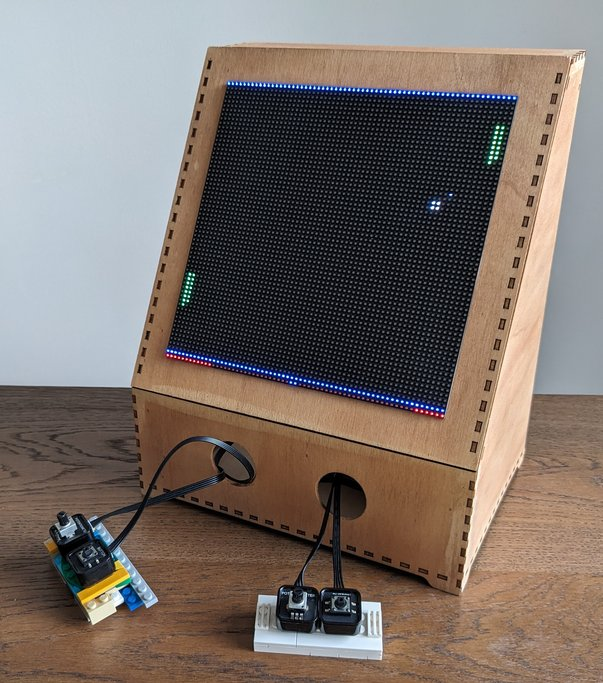

# The RGB Matrix Cabinet

My previous project, LED Space Invaders, was awarded a [Pi-Top 4](https://www.pi-top.com/) device. This fantastic, super-powered Raspberry Pi includes not only a rock-solid case, a battery, and an OLED display but also a set of input and output electronic devices. I decided to leverage the capabilities of the Pi-Top and continue the previous project by constructing a cabinet for the LED Matrix with support for the input devices.



## Hardware

I am not affiliated in any way with the following vendors. The links are provided so you can find the hardware I obtained; feel free to purchase your hardware from the vendor of your preference.

- [RGB Led Matrix](https://www.elektor.nl/joy-it-64x64-rgb-led-matrix-module)
- [Controller board for the RGB Led matrix](https://www.elektor.nl/joy-it-raspberry-pi-controllerboard-for-rgb-led-matrix)
- [Power supply for the RGB Led Matrix](https://etronixcenter.com/nl/led-transformatoren/8169311-sps36-nedro-dc5v-4a-20w-schakel-stroomadapter-driver-transformator-7110218614005.html)
- [Raspberry Pi 4](https://thepihut.com/products/raspberry-pi-4-model-b)
- USB Controller (Those generic that look like the old SuperNes controllers, I got them in a second hand shop)

As you can imagine, you need to connect everything together :-)

## The wooden cabinet

- [Wooden enclosure for the project](./cabinet.svg). Generated using [Boxes.py's Console2](https://www.festi.info/boxes.py/Console2?language=en).

List of resources for wood boxes:

- [Boxes.py](https://www.festi.info/boxes.py/). [Project homepage](https://hackaday.io/project/10649-boxespy).
- [List with other generators](https://www.instructables.com/The-Ultimate-Guide-to-Laser-cut-Box-Generators/)
- Places to cut the design:
  - [LaserSpace 040 (Eindhoven)](https://laserspace040.com/)
  - [De Factorij (Eindhoven)](http://de-factorij.nl/?page_id=490)
  - [Digifablab (Eindhoven)](https://www.digifab.nl)
  - [FabLab 013 (Tilburg)](https://fablab013.nl/)

## Setting up things

The code in this repository requires a third-party library for managing the LED Matrix. This library is included as a submodule of this repository. If you have not cloned the repository yet:

```bash
# If this repo has not been cloned
git clone --recurse-submodules ...
```

If the repository has already been cloned, simply update the submodule dependencies:

```bash
# If the repo has already been cloned
git submodule update --init --recursive
```

The RGB Matrix library needs to be run as root to access the timer of the Raspberry Pi (More information [here](https://github.com/hzeller/rpi-rgb-led-matrix#running-as-root), [here](https://github.com/hzeller/rpi-rgb-led-matrix/issues/680), or [here](https://github.com/hzeller/rpi-rgb-led-matrix/issues/672)). I encountered issues trying to run the game as root and gaining access to the joystick. As a workaround, I opted for a solution proposed [here](https://github.com/hzeller/rpi-rgb-led-matrix/issues/672#issuecomment-408640514):

1. Start a server (as root) that will listen for specific messages and write the images onto the screen.
2. Run the game as a non-root user and send the sprites to the server.

Some dependencies need to be fulfilled first:

```bash
```

Then the server can be cloned and built
The server requires to be built before it can be used:

```bash
# A dependency of the library
sudo apt-get install libatlas-base-dev
cd flaschen-taschen/server
make FT_BACKEND=rgb-matrix
```

The parameters for running the server may vary depending on the Raspberry Pi that runs the software (refer to the parameter `--led-slowdown-gpio`) and the position of the RGB Matrix (refer to `--led-pixel-mapper`). The provided parameters are configured for a 64x64 RGB LED Matrix running on a Raspberry Pi 4. The rotation is set for the custom position of the matrix on my desk.

```bash
sudo flaschen-taschen/server/ft-server --led-rows=64 --led-cols=64 --led-slowdown-gpio=4 --led-pixel-mapper="Rotate:270"
```

If you do not have an RGB LED Matrix, you can still play around with the game. Ensure that you compile [Flaschen taschen server to use the terminal as a backend](https://github.com/hzeller/flaschen-taschen#2-compile-and-run-local-server-showing-content-in-a-terminal), and then run the server with the following parameters.

```bash
flaschen-taschen/server/ft-server -D 64x64
```

If it looks too big in your screen use the `--hd-terminal` option.

When using Pi-Top[4], the system's `pitop` package will work flawlessly, while the one installed via `pip` may cause some dependency headaches. To avoid these problems, simply use the system packages and override specific dependencies.

```bash
python3 -m venv venv --system-site-packages
pip install --upgrade pip
pip install -r requirements.txt
```

Now you are good to go, run `cd rgb-led-games && python main.py --game <your-game-of-choice>` and enjoy the game.
